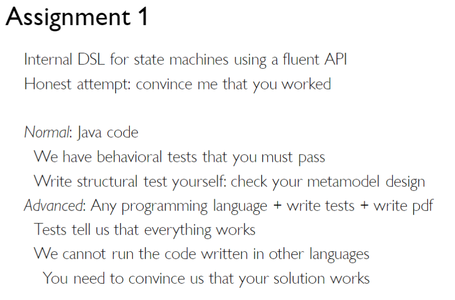

# A1



## Design

````text
stateNode: {
    string state
    map<string, list<outcome>> inputs
}

outcome: {
    () -> bool ?condition
    string ?stateOutcome
    () -> {} ?callback
}
````

### Syntax
> Original sentence outlining the logical structure for defining states and their interactions
>> Given we are in SOME_STATE, when receiving SOME_INPUT, and (optionally) SOME_CONDITION is met (true), 
> then transition to SOME_OTHER_STATE and/or execute SOME_CALLBACK, alternatively end the model.

> Translated into a shorter syntax and selecting method name candidates
>> `GIVEN` [SOME_STATE] `WHEN` [SOME_INPUT] (`AND` [SOME_CONDITION]) (`THEN` [SOME_OTHER_STATE]/[SOME_CALLBACK]) / `END`
    

### API

From method name candidates we can start to design how they will look in code form.
For all the methods we want them to return the statemachine API object itself, so we can chain the methods.
When designing the interface we can make it generic, 
so we later in the implementation can specify the implementation class as the return type.

> `given`
> 
> Specifying the state the model should be in.
> ````java
> T given(String state); 
> ````

> `when`
> 
> Specifying the input for an outcome.
> ````java
> T when(String input);
> ````

> `and`
> 
> Add an optional condition that will be checked, and must be true, on an input.
> ````java
> T and(Condition condition);
> ````
> 
> `condition`
> ````java
> public interface Condition {
>   boolean check();
> }
> ````

> `then`
> 
> Specify some code that will be run by the model on successful input and condition.
> ````java
> T then(Callback callback);
> ````
> 
> `callback`
> 
> ````java
> public interface Callback {
>   void call();
> }
> ````

> `then`
> 
> Specify which state the model will go to on successful input and condition
> ````java
> T then(String nextState);
> ````

> `end`
> 
> Something that is not apparent from the three diagrams, is the ability for the statemachine to reach an end.
> ````java
> T end();
> ````
 
> `start`
> 
> We also need to tell the model which state to start in
> ````java
> T start(String initialState);
> ````

Final interfaces

````java
public interface IStateMachine<T> {
    T given(String state);
    T when(String input);
    T and(Condition condition);
    T then(Callback callback);
    T then(String nextState);
    T end();
    T start(String initialState);
}

public interface Condition {
    boolean check();
}

public interface Callback {
    void call();
}
````

## Translating the images to code

### CD Player


[CdPlayer.java](src/wafl/models/CdPlayer.java)

````java
// Simplified version of actual class
public class CdPlayer implements Model {
    private int trackIndex;
    private final List<String> trackQueue;

    public CdPlayer() {
        this.trackQueue = new ArrayList<>(){{
            add("Track_1");add("Track_2");add("Track_3");add("Track_4");add("Track_5");
        }};
        this.trackIndex = 0;

        new StateMachine("CD PLAYER")

            .given(STOPPED)
                .when(PLAY)
                .and(() -> !trackQueue.isEmpty() && trackIndex < trackQueue.size())
                .then(PLAYING)
    
                .when(FORWARD)
                .then(() -> trackIndex++)
    
                .when(BACKWARD)
                .then(() -> trackIndex--)

            .given(PLAYING)
                .when(STOP)
                .then(STOPPED)
                .then(() -> trackIndex = 0)
    
                .when(PAUSE)
                .then(PAUSED)

            .given(PAUSED)
                .when(PLAY)
                .then(PLAYING)
    
                .when(STOP)
                .then(STOPPED)
                .then(() -> trackIndex = 0)
    
                .when(FORWARD)
                .then(() -> trackIndex++)
    
                .when(BACKWARD)
                .then(() -> trackIndex--)

            .start(STOPPED);
    }
}

````

### Microwave Oven


[MicrowaveOven.java](src/wafl/models/MicrowaveOven.java)

````java
// Simplified version of actual class
public class MicrowaveOven implements Model {
    private boolean doorOpen;

    public MicrowaveOven() {
        this.doorOpen = false;

        new StateMachine("MICROWAVE OVEN")
            .given(INACTIVE)
                .when(START)
                .and(() -> !doorOpen)
                .then(COOKING)

            .given(COOKING)
                .when(TIMER)
                .then(INACTIVE)

                .when(STOP)
                .then(INACTIVE)

                .when(OPEN_DOOR)
                .then(DOOR_OPEN)
                .then(() -> doorOpen = true)

            .given(DOOR_OPEN)
                .when(CLOSE_DOOR)
                .then(() -> doorOpen = true)
                .then(COOKING)

                .when(STOP)
                .then(INACTIVE)
            
            .start(INACTIVE);
    }
}
````

### Cooking Hood


[CookingHood.java](src/wafl/models/CookingHood.java)

````java
// Simplified version of actual class
public class CookingHood implements Model {
    private int power;

    public CookingHood() {
        this.power = 0;

        new StateMachine("COOKING HOOD")

            .given(OFF)
                .when(PLUS)
                .then(ON)
                .then(() -> power = 1)

            .given(ON)
                .when(MINUS)
                .and(() -> power == 1)
                .then(OFF)
    
                .when(PLUS)
                .and(() -> power == 6)
                .then(MAX)
    
                .when(PLUS)
                .and(() -> power < 6)
                .then(() -> power++)
    
                .when(MINUS)
                .and(() -> power == 1)
                .then(OFF)
    
                .when(MINUS)
                .and(() -> power > 0)
                .then(() -> power--)

            .given(MAX)
                .when(MINUS)
                .then(ON)
                .then(() -> power = 6)
            
            .start(OFF);
    }
}
````

