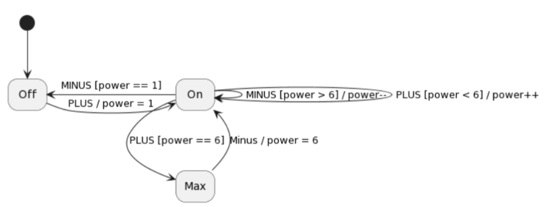

# A1

## Design

````text
stateNode: {
    string state
    list<outcome> conditions
    map<string, list<outcome>> inputs
}

outcome: {
    () -> bool ?condition
    string ?stateOutcome
    () -> {} ?callback
}
````
    

## API

`when(state)`

`on(input)`

`and(() -> bool)`

`then(() -> {})`

`then(nextState)`

## Translating the images to code

### CD Player


[CdPlayer.java](src/wafl/models/CdPlayer.java)

````java
public CdPlayer() {
    System.out.println("CD PLAYER");
    List<String> trackQueue = new ArrayList<>(){{
        add("Track_1");add("Track_2");add("Track_3");add("Track_4");add("Track_5");
    }};
    AtomicInteger trackIndex = new AtomicInteger(0);

    new StateMachine()

            .when(STOPPED)
                .on(PLAY)
                .and(() -> !trackQueue.isEmpty() && trackIndex.get() < trackQueue.size())
                .then(PLAYING)
            .when(STOPPED)
                .on(FORWARD)
                .then(trackIndex::getAndIncrement)
            .when(STOPPED)
                .on(BACKWARD)
                .then(trackIndex::getAndDecrement)

            .when(PLAYING)
                .on(STOP)
                .then(STOPPED)
                .then(() -> trackIndex.set(0))
            .when(PLAYING)
                .on(PAUSE)
                .then(PAUSED)

            .when(PAUSED)
                .on(PLAY)
                .then(PLAYING)
            .when(PAUSED)
                .on(STOP)
                .then(STOPPED)
                .then(() -> trackIndex.set(0))
            .when(PAUSED)
                .on(FORWARD)
                .then(trackIndex::getAndIncrement)
            .when(PAUSED)
                .on(BACKWARD)
                .then(trackIndex::getAndDecrement)

            .start(STOPPED);
}
````

### Microwave Oven


[MicrowaveOven.java](src/wafl/models/MicrowaveOven.java)

````java
public MicrowaveOven() {
    System.out.println("MICROWAVE OVEN");
    AtomicBoolean doorOpen = new AtomicBoolean(false);

    new StateMachine()
            .when(INACTIVE)
                .on(START)
                .and(() -> !doorOpen.get())
                .then(COOKING)
            .when(INACTIVE)
                .on(CLOSE_DOOR)
                .and(doorOpen::get)
                .then(() -> doorOpen.set(false))

            .when(COOKING)
                .on(TIMER)
                .then(INACTIVE)
            .when(COOKING)
                .on(STOP)
                .then(INACTIVE)
            .when(COOKING)
                .on(OPEN_DOOR)
                .then(DOOR_OPEN)
                .then(() -> doorOpen.set(true))

            .when(DOOR_OPEN)
                .on(CLOSE_DOOR)
                .then(() -> doorOpen.set(true))
                .then(COOKING)
            .when(DOOR_OPEN)
                .on(STOP)
                .then(INACTIVE)

            .start(INACTIVE);

}
````

### Cooking Hood



[CookingHood.java](src/wafl/models/CookingHood.java)

````java
public CookingHood() {
    System.out.println("COOKING HOOD");
    AtomicInteger power = new AtomicInteger(0);

    new StateMachine()
            .when(OFF)
                .on(PLUS)
                .then(ON)
                .then(() -> power.set(1))

            .when(ON)
                .on(MINUS)
                .and(() -> power.get() == 1)
                .then(OFF)
            .when(ON)
                .on(PLUS)
                .and(() -> power.get() == 6)
                .then(MAX)
            .when(ON)
                .on(PLUS)
                .and(() -> power.get() < 6)
                .then(power::getAndIncrement)
            .when(ON)
                .on(MINUS)
                .and(() -> power.get() == 1)
                .then(OFF)
            .when(ON)
                .on(MINUS)
                .and(() -> power.get() > 0)
                .then(power::getAndDecrement)

            .when(MAX)
                .on(MINUS)
                .then(ON)
                .then(() -> power.set(6))

            .start(OFF);
}
````

